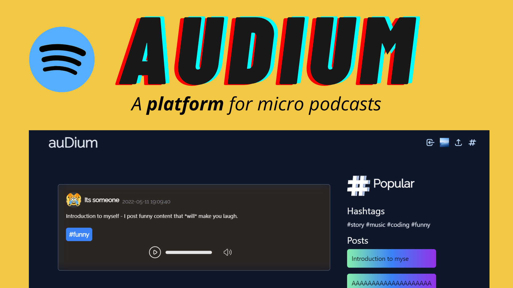
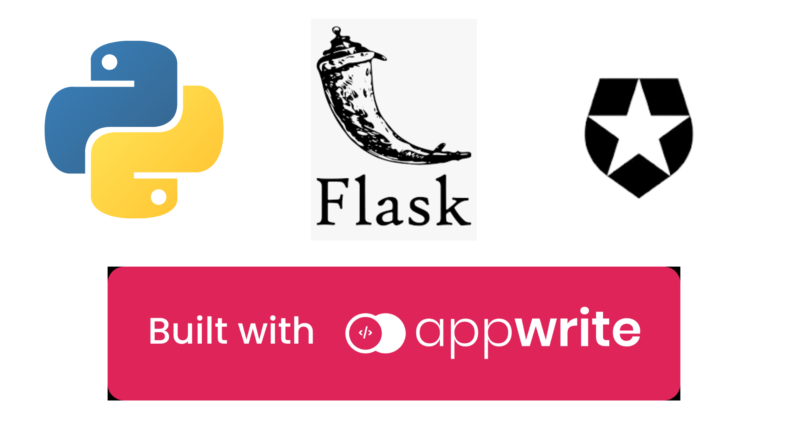

## auDium

A simple, barebones "Micro-Podcast" web app
> This was made as a submission for the [Appwrite x Dev](https://dev.to/devteam/announcing-the-appwrite-hackathon-on-dev-1oc0) Hackathon

***
<br><br>

# 👀 Inspiration

Short content is blowing up nowadays, with the rise of social media that provide short-form content and popular websites making a shift from long to short, it's time to make short podcasts.

This was inspired by Twitter - which is considered a "micro-blogging" platform. It's a simple way to share your thoughts, ideas, and stories.

auDium is a simple web app that does exactly that, but with audio. It's like spotify + twitter.

# 📱 Screenshots


<br><br><br><br><br>

# ⚙️ Built with



## 🔘 Where Appwrite helps:

- Database : All the posts are stored in an appwrite database instance. Appwrite makes databases very easy with it's [python SDK](https://github.com/appwrite/sdk-for-python)

- Storage : All the audio files are stored in the appwrite storage instance. 


Authentication, however, is provided by [Auth0](https://auth0.com), which provides really powerful and easy to use authentication interface

## Small note

For the purpose of this hackathon, the app is very barebones. It's not meant to be used as a full-fledged social media yet, but I'll be constantly working on new features and improvements.

So, for now, you can consider it as a proof of concept that works

Also, the app is not hosted because I don't have the funds to host Appwrite on my own, and this projects needs quite a bit of storage too, which I don't have. So, for now, you can only use it in the development environment, on your local machine.


## Setup

Clone the repository
```
git clone https://github.com/dhravya/audium-app.git
```

Install the dependencies (in a virtual environment)
```
cd audium-app
python -m venv env
source env/bin/activate # Or env/scripts/activate on Windows
pip install -r requirements.txt
```

Run the server
```
py src/app.py
```

## Support

- Follow me on Github - [@dhravya](https://github.com/dhravya)
- Follow me on Twitter - [@dhravyashah](https://twitter.com/dhravyashah)

[](https://ko-fi.com/R6R782RBF)